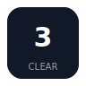
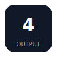
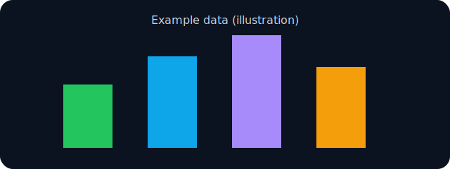
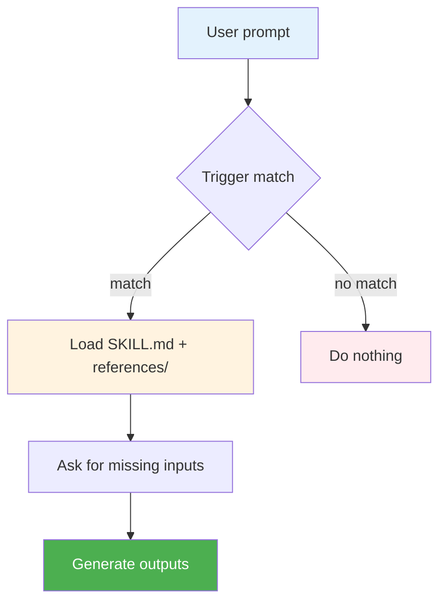

<div align="center">
  
</div>

# hello-auditkit

<div align="center">

**Audit/review/validate AI assistant configurations with file-only reports.**

[](./SKILL.md)
[](./LICENSE)
[](./CONTRIBUTING.md)

</div>

<p align="center">
  <a href="./README.md"></a>
  <a href="./README_CN.md"></a>
</p>

---

## 📑 Table of Contents

<details>
<summary><strong>Click to expand</strong></summary>

- [🎯 Why hello-auditkit?](#-why-hello-auditkit)
- [✨ Features](#-features)
- [🚀 Quick Start](#-quick-start)
- [🔧 How It Works](#-how-it-works)
- [📖 Documentation](#-documentation)
- [❓ FAQ](#-faq)
- [🛠️ Troubleshooting](#-troubleshooting)
- [📈 Version](#-version)
- [🔒 Security](#-security)
- [🤝 Contributing](#-contributing)
- [📜 License](#-license)

</details>

## 🎯 Why hello-auditkit?

This is a **Codex Skill** repo. It gives your coding assistant a repeatable workflow instead of one-off prompts.

| Challenge | Without this skill | With this skill |
|---|---|---|
| Getting started | You re-explain context every time | The workflow is encoded in `SKILL.md` |
| Output quality | Inconsistent formatting | Consistent outputs + guardrails |
| Scope control | Easy to drift | Clear stop/confirm gates |
| Reuse | Hard to share | Share it as a skill folder |
| Speed | Manual, repetitive steps | Short prompts trigger full workflows |

### 💡 Best for
- ✅ You want a stable workflow in Codex/Claude/Gemini CLI skills.
- ✅ You want consistent deliverables (tables/diagrams/docs/reports).
- ✅ You prefer “ask for inputs first, then generate”.

### ⚠️ Not for
- ❌ One-off work where you do not want workflow constraints.
- ❌ Scenarios that require silent assumptions (these skills avoid guessing).

<div align="center">
  
</div>

## ✨ Features

<table>
<tr>
<td width="50%" valign="top">


**🧭 Type-aware audits**

Knows what it is auditing.
- prompts / skills / plugins / memories
- evidence + line references
- no guessing

**Your benefit:** Actionable findings.

</td>
<td width="50%" valign="top">


**🛡️ Safe by default**

Keeps scope tight.
- audits only what you provide
- no changes without confirmation
- minimal terminal output

**Your benefit:** More control.

</td>
</tr>
<tr>
<td width="50%" valign="top">



**📚 Rule-driven**

Uses checklists and registries.
- structured criteria
- repeatable results
- consistent formatting

**Your benefit:** Stable quality.

</td>
<td width="50%" valign="top">



**📦 File-only reports**

Writes reports to files.
- better for long audits
- keeps terminal clean
- easy to share

**Your benefit:** Easy review.

</td>
</tr>
</table>

### 📌 Triggers (keywords)

- `审计"、"审查"、"验证"、"检查质量"、"分析提示词"、"评估技能"、`

<div align="center">
  
</div>

## 🚀 Quick Start

### Install

1. Put this folder into your Codex skills directory:

```text
Windows: %USERPROFILE%\.codex\skills\hello-auditkit
macOS/Linux: ~/.codex/skills/hello-auditkit
```

2. Restart your CLI tool (if needed) so it reloads skills.
3. In chat, mention `hello-auditkit` or use a trigger keyword.

### First run

1. Say: `audit this SKILL.md` (or provide a path).

2. It writes the audit report to a file.

3. Review, then decide whether to apply fixes.

## 🔧 How It Works

<details>
<summary><strong>📊 Click to view the workflow</strong></summary>



</details>

## 📖 Documentation

- Start here: `SKILL.md`
- If present: `references/` and `assets/` (loaded on-demand)

## ❓ FAQ

<details>
<summary><strong>Q: Does it modify files automatically?</strong></summary>

**A:** No. It requires explicit confirmation before applying any fix.
</details>

<details>
<summary><strong>Q: Where is the audit report?</strong></summary>

**A:** It is saved to a file (terminal output stays minimal).
</details>

<details>
<summary><strong>Q: Can I audit a folder?</strong></summary>

**A:** Yes, provide a folder path and specify what to check.
</details>

<details>
<summary><strong>Q: Does it use the web?</strong></summary>

**A:** It may fetch the latest prompting guidelines if needed.
</details>

<details>
<summary><strong>Q: What if the target is unclear?</strong></summary>

**A:** It will ask 1–3 clarification questions.
</details>

<details>
<summary><strong>Q: Can I limit the scope?</strong></summary>

**A:** Yes, tell it exactly which files or checks to run.
</details>

## 🛠️ Troubleshooting

### Report file not created

**Problem:** You did not provide a valid path/target.

**Fix:** Provide a concrete file/folder path and retry.

---

### It asks too many questions

**Problem:** The audit goal is ambiguous.

**Fix:** Reply with the exact target and desired depth.

---

### Line numbers look off

**Problem:** The target file changed after reading.

**Fix:** Re-run after saving the latest file.

---

### Web fetch blocked

**Problem:** Network access is unavailable.

**Fix:** Run offline mode or enable network.

---

### Output too verbose

**Problem:** Host tool settings may differ.

**Fix:** Ask it to keep terminal output minimal and write to files.

## 📈 Version

- Current version: `2.0.0` (see `SKILL.md`)

## 🔒 Security

- Do not paste secrets/tokens into prompts or sample files.
- If you find a security issue, open a minimal report without sensitive details.

## 🤝 Contributing

See `CONTRIBUTING.md`.

## 📜 License

This repository is licensed under `MIT`. See `LICENSE`.

## 📊 Project Stats

<div align="center">


</div>

<div align="center">

Made by [hellowind777](https://github.com/hellowind777)

</div>
