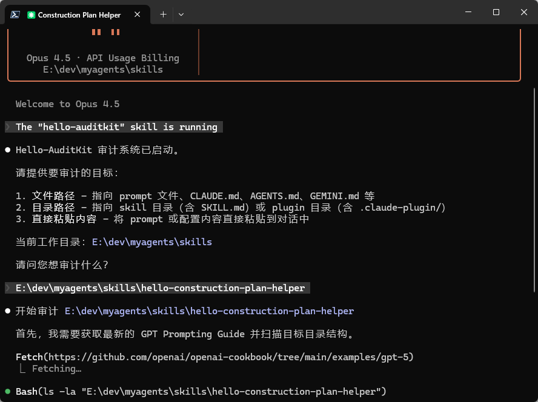

# Hello-AuditKit

<div align="center">
  

  **Evidence-first audit system for AI coding assistant configurations (prompts / memory files / skills / plugins)**

  [](./LICENSE)
  [](./hello-auditkit/SKILL.md)
  [](https://github.com/hellowind777/hello-auditkit/pulls)

  [简体中文](./README_CN.md) · [English](./README.md)
</div>

---

## What This Skill Audits

- **Prompt / any text file** (pasted text, or any file path)
- **Memory files**: `AGENTS.md`, `CLAUDE.md`, `GEMINI.md`
- **Skills**: directories containing `SKILL.md`
- **Plugins**: directories containing `.claude-plugin/` (and related config)
- **Composite systems**: multi-file setups (e.g., memory + skills/plugins)

## Core Ideas (What Makes It Different)

- **GPT Prompting Guide compliance as a primary standard** (online-first; fallback to built-in rules when offline)
- **5-point verification** to filter false positives before reporting issues
- **Evidence-first reporting**: every finding must be anchored to *file + line* and backchecked
- **No auto-fix**: fixes are proposed; nothing is applied until the user explicitly confirms

## Quick Start (Codex CLI)

### 1) Install

Copy the `hello-auditkit/` folder into your Codex skills directory:

```powershell
# Windows (PowerShell)
Copy-Item -Recurse -Force "./hello-auditkit" "$env:USERPROFILE\.codex\skills\"
```

```bash
# macOS/Linux
cp -r ./hello-auditkit ~/.codex/skills/
```

### 2) Use

In Codex CLI, invoke the skill and provide the target you want to audit:

- Example prompts:
  - `审计这个文件: ./AGENTS.md`
  - `检查这个技能目录: ./some-skill/`
  - `验证这个插件配置: ./my-plugin/`

### 3) Output

- The audit report is **saved to a file** (see `hello-auditkit/scripts/save_report.py`).
- Terminal output is **progress-only** (no full report dump).

---

## Documentation

- Skill entry point: `hello-auditkit/SKILL.md`
- Workflow guide: `hello-auditkit/references/workflow-execution.md`
- Registries (rule IDs): `hello-auditkit/references/registry/`
- Type checklists: `hello-auditkit/references/checklists/`

## Repository Layout

| Path | Purpose |
|------|---------|
| `hello-auditkit/SKILL.md` | Skill definition + phases + constraints |
| `hello-auditkit/references/` | Audit methodology, rules, checklists, registries |
| `hello-auditkit/scripts/save_report.py` | Save report to file with standardized naming |
| `hello-auditkit/assets/` | Reserved for future assets |
| `hello-auditkit/output/` | Runtime cache/output directory (gitignored except `.gitkeep`) |

## Contributing

See `CONTRIBUTING.md`.

## License

MIT. See `LICENSE`.

> Note: this skill may fetch external documents (e.g., the latest prompting guide) during runtime. Those materials remain subject to their original licenses.

---

<div align="center">
  
</div>