# Hello-AuditKit

<div align="center">

**Enterprise-grade audit system for AI coding assistant configurations — catch issues before they cause problems**

[](./LICENSE)
[](./hello-auditkit/references/)
[](./CHANGELOG.md)
[](./CONTRIBUTING.md)

[简体中文](./README_CN.md) · [English](./README.md) · [Quick Start](#-quick-start) · [Documentation](#-documentation)

</div>

---

## 🎯 Why Hello-AuditKit?

**The Problem:** AI coding assistant configurations (prompts, skills, plugins) often contain hidden issues — broken references, contradictory rules, bloated content — that cause unexpected behavior.

**The Solution:** A rigorous audit system with 4-point verification that catches real issues while filtering out false positives.

| Challenge | Without Hello-AuditKit | With Hello-AuditKit |
|-----------|------------------------|---------------------|
| **Broken References** | Silent failures, missing context | All refs verified, broken refs flagged |
| **Rule Conflicts** | Contradictory behavior | Conflicts detected with resolution suggestions |
| **Content Bloat** | Slow response, context overflow | Size thresholds with tiered warnings |
| **Vague Instructions** | Inconsistent AI behavior | Ambiguity patterns detected |
| **False Positives** | Noise drowns real issues | 4-point verification filters non-issues |

### 💡 Best For

- ✅ **Prompt Engineers** reviewing complex system prompts
- ✅ **Codex CLI / Claude Code Users** auditing memory files and skills
- ✅ **Plugin Developers** validating hooks, commands, and MCP configurations
- ✅ **Teams** establishing quality standards for AI configurations

### ⚠️ Not For

- ❌ General code review (use dedicated linters)
- ❌ Runtime monitoring (this is static analysis)
- ❌ Auto-fixing issues (provides recommendations, not auto-apply)

---

## ✨ Features

### 🎯 Core Capabilities

<table>
<tr>
<td width="50%">

**🔍 Multi-Type Audit**

Comprehensive coverage for all AI assistant configurations:
- Prompts (standalone markdown/text)
- Memory files (AGENTS.md, CLAUDE.md, GEMINI.md)
- Skills (SKILL.md + references)
- Plugins (hooks, commands, agents, MCP/LSP)

**Your benefit:** One tool for your entire AI configuration ecosystem

</td>
<td width="50%">

**✅ 4-Point Verification**

Every issue must pass rigorous validation:
- Concrete failure scenario exists
- Within design scope
- Design flaw, not choice
- Above severity threshold

**Your benefit:** No false positives drowning real issues

</td>
</tr>
<tr>
<td width="50%">

**📐 Occam's Razor Fixes**

Fix priority hierarchy: DELETE > MERGE > RESTRUCTURE > MODIFY > ADD

**Your benefit:** Simpler, cleaner configurations

</td>
<td width="50%">

**🌐 Multi-Language Output**

Supports: en-US, zh-CN, zh-TW, ja-JP, ko-KR, es-ES, fr-FR, de-DE

**Your benefit:** Audit reports in your preferred language

</td>
</tr>
</table>

### 📊 By the Numbers

- **4-point** verification prevents false positives
- **11** content types supported (prompts, memory, skills, plugins, etc.)
- **6** severity levels with quantified thresholds
- **Zero** guesswork — every issue backed by concrete scenarios

---

## 🚀 Quick Start

### Prerequisites

- Codex CLI or Claude Code installed
- Target configuration files to audit

### Installation

**Step 1: Copy skill to your assistant's skills directory**

```bash
# Windows (PowerShell)
Copy-Item -Recurse "hello-auditkit" "$env:USERPROFILE\.codex\skills\"
Copy-Item -Recurse "hello-auditkit" "$env:USERPROFILE\.claude\skills\"

# macOS/Linux
cp -r hello-auditkit ~/.codex/skills/
cp -r hello-auditkit ~/.claude/skills/
```

**Step 2: Verify installation**

```bash
# Restart Codex CLI / Claude Code and check skill is available
# The skill should auto-trigger on audit-related requests
```

**Step 3: Start auditing**

```bash
# In Codex CLI / Claude Code, simply request an audit:
"Audit my CLAUDE.md file"
"Review this skill for quality issues"
"Check this plugin configuration"
```

### First Use Example

```
User: Audit my CLAUDE.md file

Hello-AuditKit:
1. Detects content type → Memory File
2. Loads type-memory.md rules
3. Executes universal checks (naming, references, size)
4. Applies 4-point verification
5. Generates structured report
```

**Expected Output:**
```
## Audit Report: CLAUDE.md

### 1. Assessment Overview
| Dimension | Score | Notes |
|-----------|-------|-------|
| Organization | ⭐⭐⭐⭐☆ | Clear structure, minor improvements possible |
| Completeness | ⭐⭐⭐⭐⭐ | All required sections present |
...

### 3. Issue Inventory
| Category | Count |
|----------|-------|
| 🔴 Must Fix | 0 |
| 🟡 Should Fix | 2 |
| 🟢 Optional | 3 |
| ⚪ Filtered | 5 |

### 5. Conclusion
✅ Pass — No critical issues found
```

---

## 🔧 How It Works

### Architecture Overview

```mermaid
flowchart TD
    Start([User Request]) --> Detect{Content Type?}

    Detect -->|"Prompt"| LoadPrompt[Load type-prompt.md]
    Detect -->|"Memory"| LoadMemory[Load type-memory.md]
    Detect -->|"Skill"| LoadSkill[Load type-skill.md]
    Detect -->|"Plugin"| LoadPlugin[Load type-plugin.md]

    LoadPrompt --> Universal[Execute Universal Checks]
    LoadMemory --> Universal
    LoadSkill --> Universal
    LoadPlugin --> Universal

    Universal --> TypeSpecific[Execute Type-Specific Checks]
    TypeSpecific --> CrossCutting{Multi-file?}

    CrossCutting -->|Yes| Cross[Execute Cross-Cutting Checks]
    CrossCutting -->|No| Verify
    Cross --> Verify

    Verify[4-Point Verification] --> Filter{Pass All 4?}
    Filter -->|Yes| Confirm[✅ Confirmed Issue]
    Filter -->|No| Discard[⚪ Filtered]

    Confirm --> Report[Generate Report]
    Discard --> Report

    style Start fill:#e3f2fd
    style Confirm fill:#4caf50,color:#fff
    style Discard fill:#fff3e0
    style Report fill:#4caf50,color:#fff
```

<details>
<summary><strong>📊 Click to view full architecture diagram</strong></summary>



</details>

### Audit Process Explained

<table>
<tr><th>Phase</th><th>What It Does</th><th>When It Runs</th><th>Output</th></tr>

<tr>
<td><strong>1. Detection</strong></td>
<td>
• Scan target path<br>
• Identify content type<br>
• Load appropriate rules
</td>
<td>Start of every audit</td>
<td>
• Content type (prompt/memory/skill/plugin)<br>
• Rule files to apply
</td>
</tr>

<tr>
<td><strong>2. Universal Checks</strong></td>
<td>
• Naming & numbering<br>
• Reference integrity<br>
• Size thresholds<br>
• Security scan
</td>
<td>Every audit</td>
<td>
• Check results table<br>
• Suspected issues list
</td>
</tr>

<tr>
<td><strong>3. Type-Specific</strong></td>
<td>
• Apply type rules<br>
• Structure validation<br>
• Content quality checks
</td>
<td>Based on content type</td>
<td>
• Type-specific findings<br>
• Additional suspected issues
</td>
</tr>

<tr>
<td><strong>4. Verification</strong></td>
<td>
• 4-point check each issue<br>
• Filter false positives<br>
• Assign severity
</td>
<td>After all checks</td>
<td>
• Confirmed issues<br>
• Filtered issues with reasons
</td>
</tr>

</table>

**Real Example: Reference Integrity Check**

```
Before (Suspected):
  - Found: @missing-file.md reference
  - Found: #broken-anchor link
  - Found: Step 3 referenced but Step 2 missing

After (Verified):
  ✅ @missing-file.md → Confirmed (file doesn't exist)
  ⚪ #broken-anchor → Filtered (AI can infer from context)
  ✅ Step gap → Confirmed (causes confusion)
```

---

## 📖 Documentation

### Core Concepts

<table>
<tr><th>Concept</th><th>Definition</th><th>Why It Matters</th></tr>

<tr>
<td><strong>4-Point Verification</strong></td>
<td>Every issue must pass: scenario test, scope check, flaw vs choice, threshold check</td>
<td>Eliminates false positives that waste your time</td>
</tr>

<tr>
<td><strong>Occam's Razor</strong></td>
<td>Fix priority: DELETE > MERGE > RESTRUCTURE > MODIFY > ADD</td>
<td>Keeps configurations lean and maintainable</td>
</tr>

<tr>
<td><strong>Progressive Loading</strong></td>
<td>L1 (metadata) → L2 (body) → L3 (references) → L4 (scripts)</td>
<td>Optimizes context window usage</td>
</tr>

<tr>
<td><strong>Size Tolerance</strong></td>
<td>≤10% over limit = NOT an issue</td>
<td>Avoids nitpicking, focuses on real problems</td>
</tr>

</table>

### Severity Levels

| Level | Icon | Criteria |
|-------|------|----------|
| Must Fix | 🔴 | Function broken, or ≥60% executors fail |
| Should Fix | 🟡 | Quality impact, or ≥40% suboptimal results |
| Optional | 🟢 | Enhances experience, not required |
| Filtered | ⚪ | Did not pass 4-point verification |

### Reference Files

| File | Read When |
|------|-----------|
| `methodology-core.md` | Understanding verification principles |
| `rules-universal.md` | Universal checks, size thresholds |
| `type-prompt.md` | Auditing standalone prompts |
| `type-memory.md` | Auditing AGENTS.md, CLAUDE.md, GEMINI.md |
| `type-skill.md` | Auditing skills |
| `type-plugin.md` | Auditing plugins, hooks, MCP, LSP |
| `cross-*.md` | Multi-file system audits |
| `ref-output-format.md` | Report structure specification |

---

## ❓ FAQ

<details>
<summary><strong>Q: What content types can Hello-AuditKit audit?</strong></summary>

**A:**
- Prompts (any text/markdown instructions)
- Memory files (AGENTS.md, CLAUDE.md, GEMINI.md)
- Skills (directories with SKILL.md)
- Plugins (directories with .claude-plugin/)
- Composite systems (memory + skills combination)
</details>

<details>
<summary><strong>Q: How is this different from a linter?</strong></summary>

**A:** Linters check syntax and style. Hello-AuditKit audits semantic quality — rule conflicts, broken references, design coherence, and AI-specific best practices like freedom level matching.
</details>

<details>
<summary><strong>Q: What does "4-point verification" mean?</strong></summary>

**A:** Every suspected issue must pass 4 checks before being confirmed:
1. Can you describe a concrete failure scenario?
2. Is this within the design scope?
3. Is this a flaw (unintentional) or a choice (intentional)?
4. Does it meet the severity threshold?

If any check fails, the issue is filtered out.
</details>

<details>
<summary><strong>Q: Why are some issues filtered out?</strong></summary>

**A:** Common filter reasons:
- **AI Capable (FR-AI)**: AI can infer the correct behavior from context
- **Design Choice (FR-DS)**: It's intentional, not a flaw
- **Below Threshold (FR-TH)**: Impact is too small to matter
- **Within Tolerance (FR-TOL)**: e.g., 504 lines when limit is 500 (≤10% over)
</details>

<details>
<summary><strong>Q: Can I customize the audit rules?</strong></summary>

**A:** Yes. The rules are in markdown files under `references/`. You can modify thresholds, add custom checks, or adjust severity levels.
</details>

<details>
<summary><strong>Q: What languages are supported for output?</strong></summary>

**A:** Configure `OUTPUT_LANGUAGE` in SKILL.md. Supported: en-US, zh-CN, zh-TW, ja-JP, ko-KR, es-ES, fr-FR, de-DE.
</details>

<details>
<summary><strong>Q: Does it auto-fix issues?</strong></summary>

**A:** No. Hello-AuditKit provides detailed fix proposals with before/after examples, but you apply them manually. This ensures you review changes before applying.
</details>

<details>
<summary><strong>Q: How do I interpret the severity icons?</strong></summary>

**A:**
- 🔴 **Must Fix**: Blocks functionality or causes majority failures
- 🟡 **Should Fix**: Impacts quality, affects many users
- 🟢 **Optional**: Nice to have, not required
- ⚪ **Filtered**: Not a real issue (failed verification)
</details>

---

## 🛠️ Troubleshooting

### Skill Not Triggering

**Problem:** Codex CLI / Claude Code doesn't recognize audit requests

**Solution:**
```bash
# 1. Verify skill location
ls ~/.codex/skills/hello-auditkit/SKILL.md
ls ~/.claude/skills/hello-auditkit/SKILL.md

# 2. Check SKILL.md frontmatter is valid
# name, description, version fields must be present

# 3. Restart Codex CLI / Claude Code
```

---

**Problem:** Audit reports in wrong language

**Cause:** OUTPUT_LANGUAGE not set correctly

**Solution:**
```markdown
# Edit hello-auditkit/SKILL.md, find this line:
**OUTPUT_LANGUAGE: zh-CN**

# Change to your preferred language:
**OUTPUT_LANGUAGE: en-US**
```

---

**Problem:** Too many filtered issues

**Cause:** Normal — 4-point verification is strict by design

**Solution:**
```markdown
# Filtered issues are shown for transparency
# If you believe an issue should be confirmed:
1. Check the filter reason (FR-AI, FR-DS, etc.)
2. Review the 4-point criteria in methodology-core.md
3. If criteria are wrong for your use case, adjust thresholds
```

---

**Problem:** Size warnings for files just over limit

**Cause:** Misunderstanding size tolerance

**Solution:**
```markdown
# Size tolerance rules:
# ≤500 lines: Ideal (no warning)
# 500-550 (≤10% over): NOT an issue
# 550-625 (10-25% over): Info only
# 625-750 (>25% over): Warning
# >750 lines: Severe

# A 520-line file is within tolerance - no action needed
```

---

**Problem:** Missing cross-cutting checks

**Cause:** Single-file audit doesn't trigger cross-cutting

**Solution:**
```bash
# For composite systems, audit the parent directory:
"Audit the entire skills directory"

# Not just individual files:
"Audit SKILL.md"  # Won't trigger cross-file checks
```

---

## 📈 Version History

### Latest: 2.0.0 🎉

**New Features:**
- ✨ Complete rule system reorganization
- ✨ 4-point verification methodology
- ✨ Progressive loading architecture (L1-L4)
- ✨ Multi-language output support

**Improvements:**
- 📦 Separated type-specific rules into dedicated files
- 📦 Added cross-cutting analysis modules
- 📚 Comprehensive reference documentation

---

## 🤝 Contributing

1. Fork the repository
2. Create your feature branch (`git checkout -b feature/amazing-feature`)
3. Commit your changes (`git commit -m 'Add amazing feature'`)
4. Push to the branch (`git push origin feature/amazing-feature`)
5. Open a Pull Request

### Contribution Ideas

- 🐛 Found a bug? [Report it](https://github.com/hellowind777/hello-auditkit/issues)
- 💡 Have an idea? [Discuss it](https://github.com/hellowind777/hello-auditkit/discussions)
- 📝 Improve docs? PRs for typos always welcome!
- 🌍 Translate? We need help with other languages

---

## 🔒 Security

**We take security seriously.**

- ✅ No secrets in configuration files
- ✅ Path traversal prevention in reference loading
- ✅ Input validation for all user-provided paths

**Found a vulnerability?**
- Email: security@hellowind.dev (private disclosure)
- Do NOT create public issues for security bugs

---

## 📜 License & Attribution (**Commercial use allowed, attribution required**)

To ensure "commercial use allowed + attribution required", this project adopts a **dual-license** scheme:

1. **Code** — **Apache License 2.0** © 2025 Hellowind
   - Commercial use is allowed. You must retain **LICENSE** and **NOTICE** information in your distribution.
   - Include a `NOTICE` in your distribution (example):
     <pre>
     This product includes "HelloAGENTS" (author: <a href="https://github.com/hellowind777/helloagents">Hellowind</a>), licensed under the Apache License 2.0.
     </pre>

2. **Documentation (README/PROJECTWIKI/Diagrams)** — **CC BY 4.0** © 2025 Hellowind
   - Commercial use is allowed, but **attribution is required**; provide a license link and indicate whether changes were made.
   - Suggested attribution when reusing documentation:
     <pre>
     Text/graphics adapted from "HelloAGENTS" — © 2025 <a href="https://github.com/hellowind777/helloagents">Hellowind</a>, CC BY 4.0.
     </pre>

3. **Unified attribution suggestion (for both code and docs):**
     <pre>
     HelloAGENTS — © 2025 <a href="https://github.com/hellowind777/helloagents">Hellowind</a>. Code: Apache-2.0; Docs: CC BY 4.0.
     </pre>

---

## 🙏 Acknowledgments

**Inspired by:**
- [Claude Code](https://github.com/anthropics/claude-code) by Anthropic — One target assistant this tool audits
- [Codex CLI](https://github.com/openai/codex) by OpenAI — One target assistant this tool audits (and AGENTS.md format reference)
- [Gemini CLI](https://github.com/google-gemini/gemini-cli) by Google — GEMINI.md format reference

**Community:**
- All contributors who submitted PRs
- Early adopters who provided feedback
- You, for reading this far! 🎉

---

## 📞 Support & Community

- 📖 **Documentation**: You're reading it!
- 💬 **Discussions**: [GitHub Discussions](https://github.com/hellowind777/hello-auditkit/discussions)
- 🐛 **Bug Reports**: [GitHub Issues](https://github.com/hellowind777/hello-auditkit/issues)
- 💡 **Feature Requests**: [GitHub Issues](https://github.com/hellowind777/hello-auditkit/issues)

---

<div align="center">

**Made with ❤️ by [Hellowind](https://github.com/hellowind777)**

[⬆ Back to Top](#hello-auditkit)

</div>
