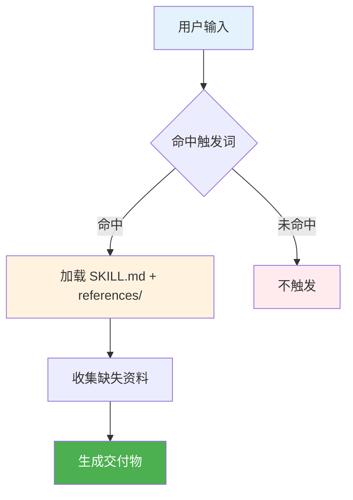

<div align="center">
  
</div>

# hello-auditkit

<div align="center">

**用“只输出到文件”的方式审计/审查/验证 AI 助手配置。**

[](./SKILL.md)
[](./LICENSE)
[](./CONTRIBUTING.md)

</div>

<p align="center">
  <a href="./README.md"></a>
  <a href="./README_CN.md"></a>
</p>

---

## 📑 目录

<details>
<summary><strong>点击展开</strong></summary>

- [🎯 为什么选择 hello-auditkit？](#-为什么选择-hello-auditkit)
- [✨ 功能特性](#-功能特性)
- [🚀 快速开始](#-快速开始)
- [🔧 工作原理](#-工作原理)
- [📖 文档](#-文档)
- [❓ FAQ](#-faq)
- [🛠️ 故障排除](#-故障排除)
- [📈 版本](#-版本)
- [🔒 安全](#-安全)
- [🤝 贡献](#-贡献)
- [📜 许可证](#-许可证)

</details>

## 🎯 为什么选择 hello-auditkit？

这是一个 **Codex Skill** 仓库：把“怎么做”固化成可复用的工作流，而不是每次都从零写提示词。

| 挑战 | 没有这个技能 | 有这个技能 |
|---|---|---|
| 上手成本 | 每次都要重新解释上下文 | 工作流已经写进 `SKILL.md` |
| 输出质量 | 格式容易漂 | 统一格式 + 约束护栏 |
| 范围控制 | 容易跑题 | 先收集资料，再确认，再生成 |
| 复用分享 | 只能复制粘贴提示词 | 直接把仓库当技能目录分发 |
| 效率 | 手动重复劳动 | 触发词一句话启动整套流程 |

### 💡 最适合
- ✅ 你在用 Codex/Claude/Gemini CLI 的 skills 体系
- ✅ 你想要“可重复、可交付”的输出（表格/图/文档/审计报告）
- ✅ 你希望先问清资料，再开始生成

### ⚠️ 不适合
- ❌ 你只想随手做一次，不想要流程约束
- ❌ 你希望工具自己猜（这些技能默认不猜）

<div align="center">
  
</div>

## ✨ 功能特性

<table>
<tr>
<td width="50%" valign="top">


**🧭 Type-aware audits**

Knows what it is auditing.
- prompts / skills / plugins / memories
- evidence + line references
- no guessing

**你的收益：** Actionable findings.

</td>
<td width="50%" valign="top">


**🛡️ Safe by default**

Keeps scope tight.
- audits only what you provide
- no changes without confirmation
- minimal terminal output

**你的收益：** More control.

</td>
</tr>
<tr>
<td width="50%" valign="top">


**📚 Rule-driven**

Uses checklists and registries.
- structured criteria
- repeatable results
- consistent formatting

**你的收益：** Stable quality.

</td>
<td width="50%" valign="top">


**📦 File-only reports**

Writes reports to files.
- better for long audits
- keeps terminal clean
- easy to share

**你的收益：** Easy review.

</td>
</tr>
</table>

### 📌 触发词（关键词）

- `审计"、"审查"、"验证"、"检查质量"、"分析提示词"、"评估技能"、`

<div align="center">
  
</div>

## 🚀 快速开始

### 安装

1. 把本仓库目录放到你的 Codex skills 目录中：

```text
Windows: %USERPROFILE%\.codex\skills\hello-auditkit
macOS/Linux: ~/.codex/skills/hello-auditkit
```

2. 如有需要，重启 CLI 以重新加载技能。
3. 在对话里提到 `hello-auditkit`，或使用触发词。

### 第一次运行

1. 直接说：`审计这个 SKILL.md`（或提供路径）。

2. 它会把审计报告写入文件。

3. 你查看后再决定是否修复。

## 🔧 工作原理

<details>
<summary><strong>📊 点击查看流程图</strong></summary>



</details>

## 📖 文档

- 从 `SKILL.md` 开始
- 如存在：`references/`、`assets/`（按需加载）

## ❓ FAQ

<details>
<summary><strong>Q：Does it modify files automatically?</strong></summary>

**A：** No. It requires explicit confirmation before applying any fix.
</details>

<details>
<summary><strong>Q：Where is the audit report?</strong></summary>

**A：** It is saved to a file (terminal output stays minimal).
</details>

<details>
<summary><strong>Q：Can I audit a folder?</strong></summary>

**A：** Yes, provide a folder path and specify what to check.
</details>

<details>
<summary><strong>Q：Does it use the web?</strong></summary>

**A：** It may fetch the latest prompting guidelines if needed.
</details>

<details>
<summary><strong>Q：What if the target is unclear?</strong></summary>

**A：** It will ask 1–3 clarification questions.
</details>

<details>
<summary><strong>Q：Can I limit the scope?</strong></summary>

**A：** Yes, tell it exactly which files or checks to run.
</details>

## 🛠️ 故障排除

### Report file not created

**问题：** You did not provide a valid path/target.

**解决：** Provide a concrete file/folder path and retry.

---

### It asks too many questions

**问题：** The audit goal is ambiguous.

**解决：** Reply with the exact target and desired depth.

---

### Line numbers look off

**问题：** The target file changed after reading.

**解决：** Re-run after saving the latest file.

---

### Web fetch blocked

**问题：** Network access is unavailable.

**解决：** Run offline mode or enable network.

---

### Output too verbose

**问题：** Host tool settings may differ.

**解决：** Ask it to keep terminal output minimal and write to files.

## 📈 版本

- 当前版本：`2.0.0`（见 `SKILL.md`）

## 🔒 安全

- 不要把 token/密码等敏感信息粘贴进提示词或样例文件。
- 如发现安全问题，建议私下反馈（或在公开 issue 中删除敏感细节）。

## 🤝 贡献

见 `CONTRIBUTING.md`。

## 📜 许可证

本仓库采用 `MIT` 授权，详见 `LICENSE`。

## 📊 项目统计

<div align="center">


</div>

<div align="center">

Made by [hellowind777](https://github.com/hellowind777)

</div>
