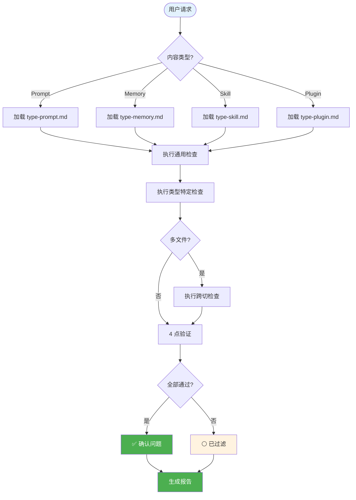

# Hello-AuditKit

<div align="center">

**企业级 AI 编码助手配置审计系统 — 在问题发生前发现它们**

[](./LICENSE)
[](./hello-auditkit/references/)
[](./CHANGELOG.md)
[](./CONTRIBUTING.md)

[简体中文](./README_CN.md) · [English](./README.md) · [快速开始](#-快速开始) · [文档](#-文档)

</div>

---

## 🎯 为什么选择 Hello-AuditKit？

**痛点：** AI 编码助手的配置（prompts、skills、plugins）经常隐藏着问题 — 断开的引用、矛盾的规则、臃肿的内容 — 导致意外行为。

**解决方案：** 一个严谨的审计系统，通过 4 点验证捕获真实问题，同时过滤误报。

| 挑战 | 没有 Hello-AuditKit | 有 Hello-AuditKit |
|------|---------------------|-------------------|
| **断开的引用** | 静默失败，缺失上下文 | 所有引用已验证，断开的引用被标记 |
| **规则冲突** | 行为矛盾 | 检测冲突并提供解决建议 |
| **内容臃肿** | 响应慢，上下文溢出 | 分级阈值警告 |
| **模糊指令** | AI 行为不一致 | 检测歧义模式 |
| **误报** | 噪音淹没真实问题 | 4 点验证过滤非问题 |

### 💡 最适合

- ✅ **Prompt 工程师** 审查复杂的系统提示词
- ✅ **Codex CLI / Claude Code 用户** 审计记忆文件与 skills
- ✅ **插件开发者** 验证 hooks、commands 和 MCP 配置
- ✅ **团队** 建立 AI 配置的质量标准

### ⚠️ 不适合

- ❌ 通用代码审查（请使用专门的 linter）
- ❌ 运行时监控（这是静态分析）
- ❌ 自动修复问题（提供建议，不自动应用）

---

## ✨ 功能特性

### 🎯 核心能力

<table>
<tr>
<td width="50%">

**🔍 多类型审计**

全面覆盖所有 AI 助手配置：
- Prompts（独立 markdown/文本）
- Memory 文件（AGENTS.md、CLAUDE.md、GEMINI.md）
- Skills（SKILL.md + references）
- Plugins（hooks、commands、agents、MCP/LSP）

**你的收益：** 一个工具覆盖整个 AI 配置生态系统

</td>
<td width="50%">

**✅ 4 点验证**

每个问题必须通过严格验证：
- 存在具体的失败场景
- 在设计范围内
- 是设计缺陷，不是设计选择
- 超过严重性阈值

**你的收益：** 没有误报淹没真实问题

</td>
</tr>
<tr>
<td width="50%">

**📐 奥卡姆剃刀修复**

修复优先级：DELETE > MERGE > RESTRUCTURE > MODIFY > ADD

**你的收益：** 更简洁、更易维护的配置

</td>
<td width="50%">

**🌐 多语言输出**

支持：en-US、zh-CN、zh-TW、ja-JP、ko-KR、es-ES、fr-FR、de-DE

**你的收益：** 使用你偏好的语言输出审计报告

</td>
</tr>
</table>

### 📊 数据说话

- **4 点** 验证防止误报
- **11** 种内容类型支持（prompts、memory、skills、plugins 等）
- **6** 个严重级别，量化阈值
- **零** 猜测 — 每个问题都有具体场景支撑

---

## 🚀 快速开始

### 前置条件

- 已安装 Codex CLI 或 Claude Code
- 要审计的目标配置文件

### 安装

**步骤 1：复制 skill 到你的助手 skills 目录**

```bash
# Windows (PowerShell)
Copy-Item -Recurse "hello-auditkit" "$env:USERPROFILE\.codex\skills\"
Copy-Item -Recurse "hello-auditkit" "$env:USERPROFILE\.claude\skills\"

# macOS/Linux
cp -r hello-auditkit ~/.codex/skills/
cp -r hello-auditkit ~/.claude/skills/
```

**步骤 2：验证安装**

```bash
# 重启 Codex CLI / Claude Code，检查 skill 是否可用
# Skill 会在审计相关请求时自动触发
```

**步骤 3：开始审计**

```bash
# 在 Codex CLI / Claude Code 中，直接请求审计：
"审计我的 CLAUDE.md 文件"
"检查这个 skill 的质量问题"
"检查这个插件配置"
```

### 首次使用示例

```
用户：审计我的 CLAUDE.md 文件

Hello-AuditKit：
1. 检测内容类型 → Memory 文件
2. 加载 type-memory.md 规则
3. 执行通用检查（命名、引用、大小）
4. 应用 4 点验证
5. 生成结构化报告
```

**预期输出：**
```
## 审计报告：CLAUDE.md

### 1. 评估概览
| 维度 | 评分 | 备注 |
|------|------|------|
| 组织性 | ⭐⭐⭐⭐☆ | 结构清晰，有小幅改进空间 |
| 完整性 | ⭐⭐⭐⭐⭐ | 所有必需章节都存在 |
...

### 3. 问题清单
| 类别 | 数量 |
|------|------|
| 🔴 必须修复 | 0 |
| 🟡 建议修复 | 2 |
| 🟢 可选优化 | 3 |
| ⚪ 已过滤 | 5 |

### 5. 结论
✅ 通过 — 未发现严重问题
```

---

## 🔧 工作原理

### 架构概览

<details>
<summary><strong>📊 点击查看完整架构图</strong></summary>



</details>

### 审计流程详解

<table>
<tr><th>阶段</th><th>做什么</th><th>何时运行</th><th>输出</th></tr>

<tr>
<td><strong>1. 检测</strong></td>
<td>
• 扫描目标路径<br>
• 识别内容类型<br>
• 加载相应规则
</td>
<td>每次审计开始</td>
<td>
• 内容类型（prompt/memory/skill/plugin）<br>
• 要应用的规则文件
</td>
</tr>

<tr>
<td><strong>2. 通用检查</strong></td>
<td>
• 命名与编号<br>
• 引用完整性<br>
• 大小阈值<br>
• 安全扫描
</td>
<td>每次审计</td>
<td>
• 检查结果表<br>
• 疑似问题列表
</td>
</tr>

<tr>
<td><strong>3. 类型特定</strong></td>
<td>
• 应用类型规则<br>
• 结构验证<br>
• 内容质量检查
</td>
<td>基于内容类型</td>
<td>
• 类型特定发现<br>
• 额外疑似问题
</td>
</tr>

<tr>
<td><strong>4. 验证</strong></td>
<td>
• 4 点检查每个问题<br>
• 过滤误报<br>
• 分配严重级别
</td>
<td>所有检查后</td>
<td>
• 确认的问题<br>
• 已过滤问题及原因
</td>
</tr>

</table>

**实例：引用完整性检查**

```
之前（疑似）：
  - 发现：@missing-file.md 引用
  - 发现：#broken-anchor 链接
  - 发现：引用了 Step 3 但 Step 2 缺失

之后（验证）：
  ✅ @missing-file.md → 确认（文件不存在）
  ⚪ #broken-anchor → 过滤（AI 可从上下文推断）
  ✅ Step 缺口 → 确认（导致混乱）
```

---

## 📖 文档

### 核心概念

<table>
<tr><th>概念</th><th>定义</th><th>重要性</th></tr>

<tr>
<td><strong>4 点验证</strong></td>
<td>每个问题必须通过：场景测试、范围检查、缺陷 vs 选择、阈值检查</td>
<td>消除浪费你时间的误报</td>
</tr>

<tr>
<td><strong>奥卡姆剃刀</strong></td>
<td>修复优先级：DELETE > MERGE > RESTRUCTURE > MODIFY > ADD</td>
<td>保持配置精简可维护</td>
</tr>

<tr>
<td><strong>渐进加载</strong></td>
<td>L1（元数据）→ L2（正文）→ L3（引用）→ L4（脚本）</td>
<td>优化上下文窗口使用</td>
</tr>

<tr>
<td><strong>大小容忍度</strong></td>
<td>≤10% 超限 = 不是问题</td>
<td>避免吹毛求疵，专注真实问题</td>
</tr>

</table>

### 严重级别

| 级别 | 图标 | 标准 |
|------|------|------|
| 必须修复 | 🔴 | 功能损坏，或 ≥60% 执行者失败 |
| 建议修复 | 🟡 | 影响质量，或 ≥40% 结果不佳 |
| 可选优化 | 🟢 | 提升体验，非必需 |
| 已过滤 | ⚪ | 未通过 4 点验证 |

### 参考文件

| 文件 | 何时阅读 |
|------|----------|
| `methodology-core.md` | 理解验证原则 |
| `rules-universal.md` | 通用检查、大小阈值 |
| `type-prompt.md` | 审计独立 prompts |
| `type-memory.md` | 审计 AGENTS.md、CLAUDE.md、GEMINI.md |
| `type-skill.md` | 审计 skills |
| `type-plugin.md` | 审计 plugins、hooks、MCP、LSP |
| `cross-*.md` | 多文件系统审计 |
| `ref-output-format.md` | 报告结构规范 |

---

## ❓ 常见问题

<details>
<summary><strong>Q：Hello-AuditKit 可以审计哪些内容类型？</strong></summary>

**A：**
- Prompts（任意文本/markdown 指令）
- Memory 文件（AGENTS.md、CLAUDE.md、GEMINI.md）
- Skills（包含 SKILL.md 的目录）
- Plugins（包含 .claude-plugin/ 的目录）
- 组合系统（memory + skills 组合）
</details>

<details>
<summary><strong>Q：这和 linter 有什么区别？</strong></summary>

**A：** Linter 检查语法和风格。Hello-AuditKit 审计语义质量 — 规则冲突、断开的引用、设计一致性，以及 AI 特有的最佳实践如自由度匹配。
</details>

<details>
<summary><strong>Q：什么是"4 点验证"？</strong></summary>

**A：** 每个疑似问题必须通过 4 项检查才能被确认：
1. 能描述具体的失败场景吗？
2. 在设计范围内吗？
3. 是缺陷（非故意）还是选择（故意）？
4. 达到严重性阈值了吗？

任何一项检查失败，问题就会被过滤。
</details>

<details>
<summary><strong>Q：为什么有些问题被过滤了？</strong></summary>

**A：** 常见过滤原因：
- **AI 可推断（FR-AI）**：AI 可从上下文推断正确行为
- **设计选择（FR-DS）**：这是故意的，不是缺陷
- **低于阈值（FR-TH）**：影响太小，无关紧要
- **容忍范围内（FR-TOL）**：例如 504 行，限制是 500（≤10% 超限）
</details>

<details>
<summary><strong>Q：我可以自定义审计规则吗？</strong></summary>

**A：** 可以。规则在 `references/` 下的 markdown 文件中。你可以修改阈值、添加自定义检查或调整严重级别。
</details>

<details>
<summary><strong>Q：输出支持哪些语言？</strong></summary>

**A：** 在 SKILL.md 中配置 `OUTPUT_LANGUAGE`。支持：en-US、zh-CN、zh-TW、ja-JP、ko-KR、es-ES、fr-FR、de-DE。
</details>

<details>
<summary><strong>Q：它会自动修复问题吗？</strong></summary>

**A：** 不会。Hello-AuditKit 提供详细的修复建议和前后对比示例，但需要你手动应用。这确保你在应用更改前进行审查。
</details>

<details>
<summary><strong>Q：如何理解严重性图标？</strong></summary>

**A：**
- 🔴 **必须修复**：阻断功能或导致多数失败
- 🟡 **建议修复**：影响质量，影响很多用户
- 🟢 **可选优化**：锦上添花，非必需
- ⚪ **已过滤**：不是真实问题（验证失败）
</details>

---

## 🛠️ 故障排除

### Skill 未触发

**问题：** Codex CLI / Claude Code 不识别审计请求

**解决方案：**
```bash
# 1. 验证 skill 位置
ls ~/.codex/skills/hello-auditkit/SKILL.md
ls ~/.claude/skills/hello-auditkit/SKILL.md

# 2. 检查 SKILL.md frontmatter 是否有效
# name、description、version 字段必须存在

# 3. 重启 Codex CLI / Claude Code
```

---

**问题：** 审计报告语言错误

**原因：** OUTPUT_LANGUAGE 设置不正确

**解决方案：**
```markdown
# 编辑 hello-auditkit/SKILL.md，找到这行：
**OUTPUT_LANGUAGE: zh-CN**

# 改为你偏好的语言：
**OUTPUT_LANGUAGE: en-US**
```

---

**问题：** 过滤的问题太多

**原因：** 正常 — 4 点验证设计上就是严格的

**解决方案：**
```markdown
# 过滤的问题是为了透明度而显示的
# 如果你认为某个问题应该被确认：
1. 检查过滤原因（FR-AI、FR-DS 等）
2. 审查 methodology-core.md 中的 4 点标准
3. 如果标准不适合你的用例，调整阈值
```

---

**问题：** 文件刚超限就警告

**原因：** 误解大小容忍度

**解决方案：**
```markdown
# 大小容忍规则：
# ≤500 行：理想（无警告）
# 500-550（≤10% 超限）：不是问题
# 550-625（10-25% 超限）：仅供参考
# 625-750（>25% 超限）：警告
# >750 行：严重

# 520 行的文件在容忍范围内 - 无需操作
```

---

**问题：** 缺少跨切检查

**原因：** 单文件审计不触发跨切检查

**解决方案：**
```bash
# 对于组合系统，审计父目录：
"审计整个 skills 目录"

# 不仅仅是单个文件：
"审计 SKILL.md"  # 不会触发跨文件检查
```

---

## 📈 版本历史

### 最新：2.0.0 🎉

**新功能：**
- ✨ 完整的规则系统重组
- ✨ 4 点验证方法论
- ✨ 渐进加载架构（L1-L4）
- ✨ 多语言输出支持

**改进：**
- 📦 类型特定规则分离到专用文件
- 📦 添加跨切分析模块
- 📚 全面的参考文档

---

## 🤝 贡献

1. Fork 仓库
2. 创建功能分支（`git checkout -b feature/amazing-feature`）
3. 提交更改（`git commit -m 'Add amazing feature'`）
4. 推送分支（`git push origin feature/amazing-feature`）
5. 开启 Pull Request

### 贡献建议

- 🐛 发现 bug？[报告它](https://github.com/hellowind777/hello-auditkit/issues)
- 💡 有想法？[讨论它](https://github.com/hellowind777/hello-auditkit/discussions)
- 📝 改进文档？欢迎 PR！
- 🌍 翻译？我们需要其他语言的帮助

---

## 🔒 安全

**我们认真对待安全。**

- ✅ 配置文件中无密钥
- ✅ 引用加载时防止路径遍历
- ✅ 所有用户提供的路径都有输入验证

**发现漏洞？**
- 邮箱：security@hellowind.dev（私密披露）
- 请勿为安全 bug 创建公开 issue

---

## 许可证与署名（**允许商用，但必须注明出处**）

为确保"允许商用 + 必须署名"，本项目采用**双许可证**：

1. **代码** — **Apache License 2.0** © 2025 Hellowind
   - 允许商业使用。要求在分发中保留 **LICENSE** 与 **NOTICE** 信息（版权与许可说明）。
   - 在你的分发包中加入 `NOTICE`（示例）：
     <pre>
     本产品包含 "HelloAGENTS"（作者：<a href="https://github.com/hellowind777/helloagents">Hellowind</a>），依据 Apache License 2.0 授权。
     </pre>

2. **文档（README/PROJECTWIKI/图表）** — **CC BY 4.0** © 2025 Hellowind
   - 允许商业使用，但**必须署名**；需给出许可链接并标注是否做了修改。
   - 复用文档时建议的署名例句：
     <pre>
     文本/图表改编自 "HelloAGENTS" —— © 2025 <a href="https://github.com/hellowind777/helloagents">Hellowind</a>，CC BY 4.0。
     </pre>

3. **统一署名建议（代码与文档皆可）**：
     <pre>
     HelloAGENTS — © 2025 <a href="https://github.com/hellowind777/helloagents">Hellowind</a>. 代码：Apache-2.0；文档：CC BY 4.0。
     </pre>

---

## 🙏 致谢

**灵感来源：**
- [Claude Code](https://github.com/anthropics/claude-code) by Anthropic — 本工具审计目标之一
- [Codex CLI](https://github.com/openai/codex) by OpenAI — 本工具审计目标之一（并作为 AGENTS.md 格式参考）
- [Gemini CLI](https://github.com/google-gemini/gemini-cli) by Google — GEMINI.md 格式参考

**社区：**
- 所有提交 PR 的贡献者
- 提供反馈的早期用户
- 你，读到这里！🎉

---

## 📞 支持与社区

- 📖 **文档**：你正在阅读！
- 💬 **讨论**：[GitHub Discussions](https://github.com/hellowind777/hello-auditkit/discussions)
- 🐛 **Bug 报告**：[GitHub Issues](https://github.com/hellowind777/hello-auditkit/issues)
- 💡 **功能请求**：[GitHub Issues](https://github.com/hellowind777/hello-auditkit/issues)

---

<div align="center">

**用 ❤️ 制作 by [Hellowind](https://github.com/hellowind777)**

[⬆ 回到顶部](#hello-auditkit)

</div>
